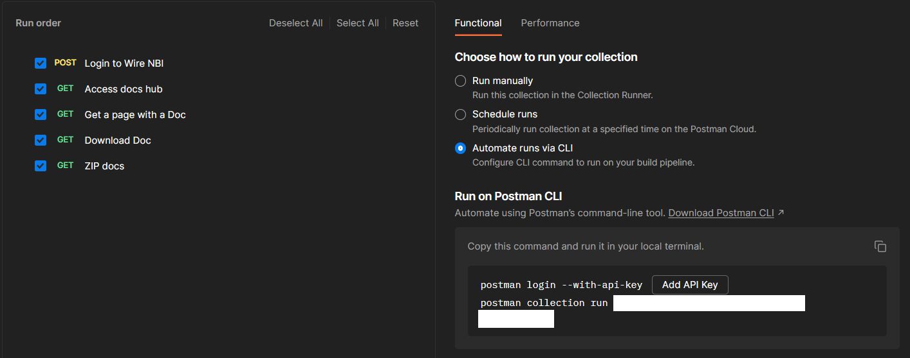

# BulkDownload
Collection of Postman curl commands to run in a collection and a python REST server for the localhost to download all the files in the HR tab from The Wire.

## Installation
It is necessary to have Python installed, as well as both Postman app and CLI.

It is also necessary to import the collection to run to Postman:

- **In Postman app, go to Collections -> Import -> Select the file named BulkDocsWire.postman_collection.json in the git repository.**

## Usage
### Inputs
**On the Post request "Login to Wire NBI":**
>1. Change the \<NBI_EMAIL> field to your email.
>2. Change the \<PASSWORD> field to your password.

Like so:

### Launch scripts
#### Local Endpoint
Open a CMD terminal (Windows Powershell, i.e) inside the git repository and run the command: **python writer.py**.
Like so:

Keep this terminal open while opening a different terminal.

#### Postman
In Postman app, go to Collections -> ... -> Run Collection:

In the newly opened tab, choose Functional -> Automate runs via CLI. In the tab beneath that pops up (Run on Postman CLI), there are 2 Postman CLI commands that will be necessary to run on the second terminal.

Therefore, it is necessary to generate a API Key by pressing the corresponding button. Afterwards, the commands should be in this format:
>postman login --with-api-key <API_KEY_GENERATED>
>postman collection run <COLLECTION_ID>

These commands should then be copy and pasted on the new terminal window, as such:

#### Result
A folder named ZipDocsExtracted.zip will appear after the end of the scripts runs, containing all the files extracted.
